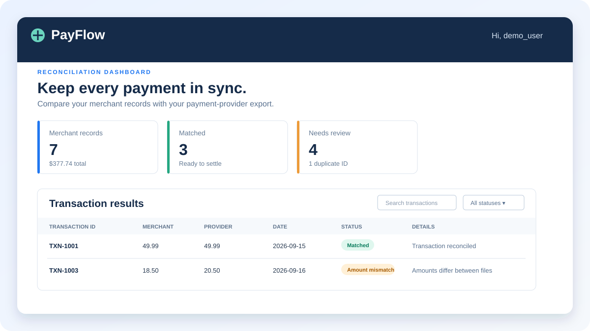

# PayFlow 💳

> A simple, secure, and beginner-friendly payment reconciliation dashboard built with Flask.

PayFlow compares **simulated** merchant and payment-provider CSV exports so you can quickly find transactions that match, are missing, are duplicated, or have an incorrect amount. It is an educational portfolio project — it never processes real payments.




## ✨ Highlights

| Feature | What it does |
| --- | --- |
| 🔐 Account access | Sign up and log in with securely hashed passwords. |
| 📤 CSV uploads | Upload merchant and payment-provider transaction exports. |
| 🔎 Smart matching | Matches records using `transaction_id`. |
| ⚠️ Issue detection | Flags missing records, duplicate IDs, amount mismatches, and currency mismatches. |
| 📊 Clear dashboard | Displays summary cards and a searchable, filterable table. |
| 💾 Backend history | Saves each user's reconciliation reports and transaction results in SQLite. |
| 📥 CSV exports | Download a saved reconciliation report whenever you need it. |

## 🧭 How it works

```text
Merchant CSV ──┐
               ├──► PayFlow reconciliation engine ───► Dashboard + saved CSV report
Provider CSV ──┘                     │
                                    SQLite backend
```

## 🚀 Run locally

### 1. Prerequisites

Install [Python 3.10 or newer](https://www.python.org/downloads/) and [VS Code](https://code.visualstudio.com/).

### 2. Create a virtual environment

Open this project folder in VS Code, then open **Terminal → New Terminal** and run:

```powershell
python -m venv .venv
.\.venv\Scripts\Activate.ps1
```

You should see `(.venv)` at the start of the terminal line.

### 3. Install and start

```powershell
pip install -r requirements.txt
python app.py
```

Open [http://127.0.0.1:5000](http://127.0.0.1:5000), create an account, and explore the sample reconciliation dashboard.

To stop the app, press `Ctrl+C`. On macOS or Linux, activate the virtual environment with:

```bash
source .venv/bin/activate
```

## 📄 CSV format

Both files must be UTF-8 `.csv` files with exactly these required columns:

```csv
transaction_id,amount,currency,date
TXN-1001,49.99,USD,2026-09-15
```

Use the fictional files in `sample_data/` to see the expected format. They intentionally include a duplicate ID, a missing transaction, and an amount mismatch.

## 🧪 Run the tests

With your virtual environment active:

```powershell
python -m unittest discover -s tests -v
```

## ☁️ Deploy for an interview

To keep PayFlow online after you close VS Code, deploy it to Render. The included `render.yaml` configures a free, interview-demo-ready web service.

1. Push this repository to GitHub.
2. Create a [Render](https://render.com) account.
3. Select **New → Blueprint** in Render.
4. Connect this GitHub repository and select **Apply**.
5. Open the generated `https://...onrender.com` URL when the deployment is live.

> **Free-demo note:** Render's free web service can sleep after inactivity and does not preserve this app's SQLite database after a restart or redeploy. Create a fresh demo account before your interview. For long-term accounts and report storage, use a managed PostgreSQL database.

## 🗂️ Project structure

```text
PayFlow/
├── app.py                  # Flask routes, authentication, uploads, and CSV export
├── database.py             # SQLite backend persistence layer
├── reconciliation.py       # Matching rules and NumPy-powered totals
├── templates/              # Dashboard, login, and signup pages
├── static/                 # CSS and browser-side search/filtering
├── sample_data/            # Safe fictional transaction exports
├── tests/                  # Automated application tests
└── render.yaml             # Render deployment configuration
```

## 🛡️ Data and security notes

- This project uses simulated data only. Do not upload real customer or payment information.
- Passwords are stored as hashes, never plain text.
- Each signed-in user can access only their own saved reports.

---

Built with Python, Flask, NumPy, HTML, CSS, JavaScript, and SQLite.
